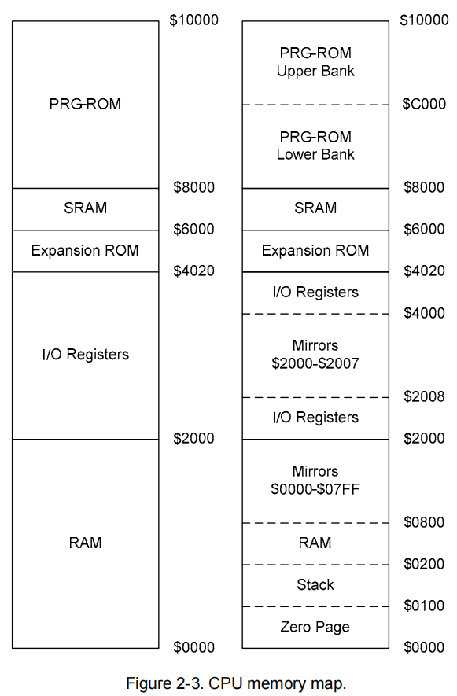

# CPU
CPU控制着游戏的执行，NES中使用6502CPU，下面从寄存器、指令格式、地址空间来介绍该CPU。
## 寄存器
PC：指令所在的内存地址，通过PC可以读取指令（16位）  
SP：栈指针，表示当前栈顶指向的内存地址（16位）  
A：累加器寄存器（8位）  
X：一般寄存器（8位）  
Y：一般寄存器（8位）  
P：状态寄存器（8位，每一位解释如下）  
~~~c++
struct {
    bool C : 1;  // carry
    bool Z : 1;  // zero
    bool I : 1;  // interrupt disable
    bool D : 1;  // decimal mode
    bool B : 1;  // break comand
    bool U : 1;  // unused always pushed as 1
    bool V : 1;  // overflow
    bool N : 1;  // negative
}；
~~~
## 指令格式
指令操作码长度为一个字节，按个人理解可以分为3大类，隐含型（implied）、相对型、普通类型  
隐含型和相对型的编码为固定类型，以8bit来确定具体是哪一条的指令  
普通类型通过bit 7-5、bit 1-0来确定具体是哪一条指令，bit 4-2表示CPU指令的寻址方式（意味着相同的一条指令可能存在多种寻址方式。bit 4-2相同的不同指令之间寻址方式可能不同，因此还需要根据bit 1-0的值来确定具体是哪一种寻址方式，例如bit 4-2为000，bit 1-0为00和10时，寻址方式为立即数型，当bit 1-0为01时为变址间接型；也有相同的情况，如bit 4-2为001时，不论bit 1-0为何值，都表示零页寻址）  
实际上可以再将普通类型按照bit 1-0的值细分为三大类，但由于相同的寻址方式CPU的操作是一致的，归为一类可以实现代码复用
## 地址空间
6502拥有16位的地址总线，最高可以支持64KB的内存访问，下方是地址空间的布局的示意图，左边是大致布局，右边是详细布局，接下来详细解释各个部分。

首先，CPU自身拥有0x800大小的内存空间，0x0000-0x00FF空间被称为零页，寻址方式为零页寻址的CPU指令可以执行得更快，0x0100-0x01FF作为CPU的栈空间，0x0200-0x07FF为正常的内存空间，0x0800-0x1FFF是0x0000-0x0800的镜像，意味着当地址总线访问到0x0800、0x1000、0x1800等同于访问0x0000。

0x2000-0x2007分别对应的PPU内的寄存器，通过读写这些地址可以与PPU进行通信，0x2008-0x3FFF是0x2000-0x2007的镜像，0x4000-0x401F对应着APU内的寄存器，以及控制PPU内的DMA和控制输入设备（手柄）

0x4020-0x5FFF暂不了解，一般不会用到

0x6000-0x8000则对应着Cartridge内的battery-backed RAM(由mapper进行映射)

0x8000-0x10000则对应着Cartridge内的PRG ROM（由mapper进行映射）

