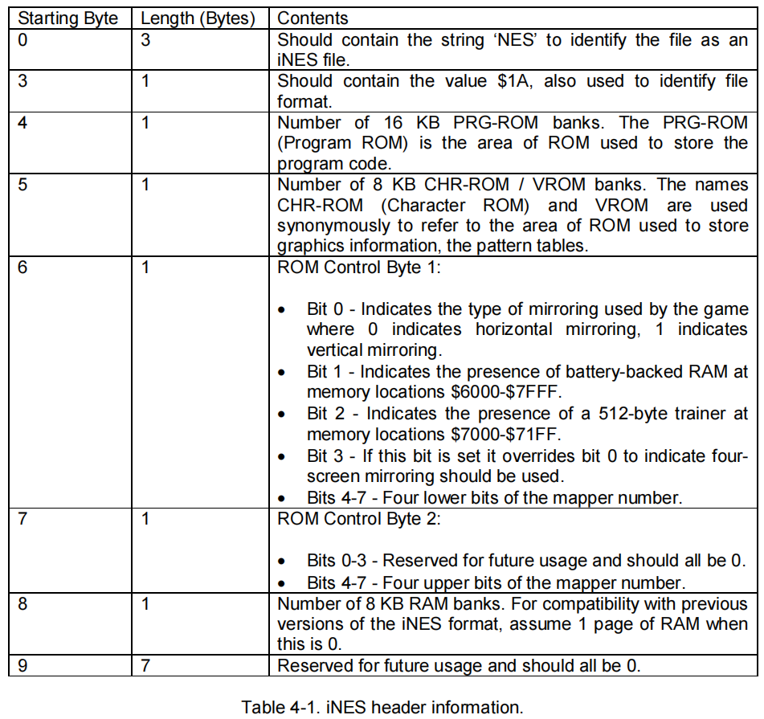

# Cartridge

游戏卡带，由游戏程序(PRG ROM)、游戏数据（CHR ROM）、电池供电的内存（battery-backed RAM，部分卡带拥有，在NES和其他一些早期的游戏系统中，电池供电的RAM被用来存储游戏进度和高分记录）和映射器（Mapper，用于将CPU以及PPU的部分地址空间映射到特定的位置）组成，在PC上通常使用iNES和NES2.0格式的文件（通常以.nes作为后缀）来保存相关信息。

## iNES格式
文件按顺序排列为head（16字节）、trainer(512字节，如果存在的话。通常在游戏启动时将其加载到RAM的特定位置)、PRG ROM（以16KB为单位的代码块）、CHR ROM（以8KB为单位的数据块）
### Header
前三个字节分别表示“NES”三个字母的ASCII码  
第四个字节的值为0x1A(EOF)  
第五个字节表示PRG ROM的块数  
第6个字节表示CHR ROM的块数  
第7个字节：  
bit 0:表示游戏的画面镜像类型，0表示水平镜像，1表示竖直镜像(在PPU章节详细解释)  
bit 1:表示battery-backed RAM是否存在  
bit 2:表示是否存在trainer数据块
bit 3:表示游戏的画面镜像类型，若为1，则覆盖bit 0的结果，表示为four-screnn镜像
bit 4-7: 表示mapper number（标志着mapper的类型）的低4位  
第8个字节：  
bit 0-3: 未使用的（为将来的用途保留）
bit 0-3: 表示mapper number（标志着mapper的类型）的高4位  
剩余字节未使用（为将来的用途保留）  

  

## NES 2.0格式
前四个字节与iNES格式相同，当headr的第8个字节的第3，4位为1时则为NES 2.0格式，即`header[7] & 0x0C == 0x08`