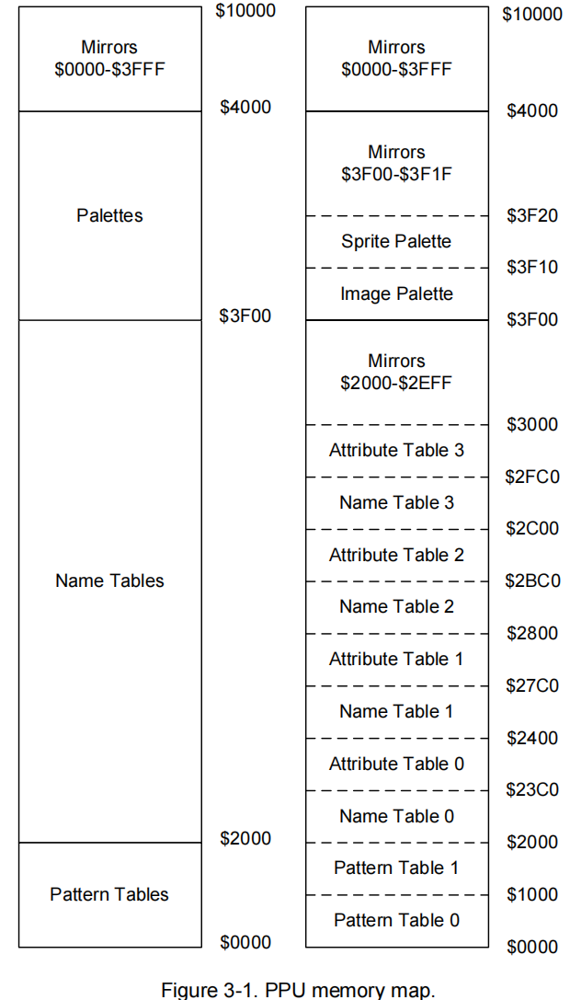
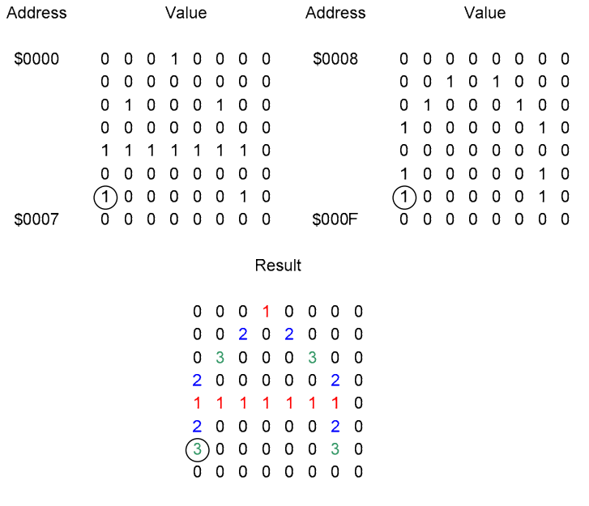
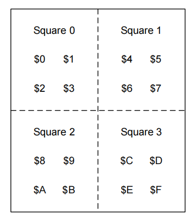

# PPU
PPU负责渲染游戏画面，下面将从寄存器、PPU的地址空间、游戏数据、具体的渲染逻辑来介绍该部分。
## 寄存器
`PPUCTROL(0x2000)`:只能写入
~~~c++
struct {
    uint8_t NN : 2;  // nametable select
    bool I : 1;      // increment mode
    bool S : 1;      // sprite tile select, 0: 0x0000, 1:0x1000
    bool B : 1;      // background tile select, 0: 0x0000, 1:0x1000
    bool H : 1;      // sprite height, 0: 8*8 pixels, 1: 8*16 pixels
    bool P : 1;      // PPU master/slave
    bool V : 1;      // NMI enable
};
~~~
`PPUMASK(0x2001)`:只能写入
~~~c++
struct {
    bool G : 1;       // greyscale
    bool m : 1;       // background left 8 column enable
    bool M : 1;       // sprite left 8 column enable
    bool b : 1;       // background enable
    bool s : 1;       // sprite enable
    uint8_t BGR : 3;  // color emphasis
};
~~~
`PPUSTATUS(0x2002)`:只能读取
~~~c++
struct {
    uint8_t U : 5;  // unused
    // sprite overflow This flag is set during sprite evaluation and cleared at dot 1
    // (the second dot) of the pre-render line.
    bool O : 1;    
    // sprite 0 hit.
    // Sprite 0 hit is not detected at x=255, nor is it detected at x=0 through 7
    // if the background or sprites are hidden in this area. 
    bool S : 1;  
    bool V : 1;  // vblank
};
~~~
`OAMADDR(0x2003)`:OAM的地址，只能写入  
`OAMADATA(0x2004)`:OAM数据，可以读写  
`PPUSCROLL(0x2005)`:滚动地址，只能写入  
`PPUADDR(0x2006)`:PPU内存的地址，只能写入  
`PPUDATA(0x2007)`:PPU内存数据，可以读写  
`OAMDMA(0x4014)`:触发PPU的DMA，将CPU地址空间的数据拷贝到OAM里，只能写入

PPU内部寄存器，通过上述部分寄存器的写入改变它们的值
~~~c++
// yyy NN YYYYY XXXXX
// ||| || ||||| +++++-- coarse X scroll
// ||| || +++++-------- coarse Y scroll
// ||| ++-------------- nametable select
// +++----------------- fine Y scroll
uint16_t _v;    // current VRAM address
uint16_t _t;    // temporary VRAM address
uint8_t _x;     // fine X scroll, 3bits
bool _w;        // write toggle, 0-->first, 1-->second
~~~
## PPU的地址空间
PPU拥有16位地址总线，最高可以支持64KB的内存访问，下方是地址空间的布局的示意图，左边是大致布局，右边是详细布局，接下来详细解释各个部分。

0x0000-0x1FFFF对应着Cartridge内的CHR ROM（由mapper映射）

0x2000-0x2FFF对应着四个逻辑名称表L1（0x2000）、L2（0x2400）、L3（0x2800）、L4（0x2C00）和属性表（具体作用将在后面介绍），这部分地址映射到PPU内的内存VRAM（大小为0x800，2KB），但由于mapper中设置的画面镜像类型（在Cartridge章节的header中提到过）会有不同的映射方式。下面以垂直镜像举例（水平移动的游戏，如SuperMario）：L1和L3映射到从0x000开始的内存（0x2000和0x2800映射到VRAM[0x000]），而L2和L4映射到从0x400开始的内存（0x2400和0x2C00映射到VRAM[0x400]）。由于随着游戏的运行，画面会出现滚动，因此一幅画面由L1的一部分和L2的一部分共同组成，当完成一帧的渲染时，由于_v（当前VRAM的地址）可能会发生变化，因此画面可能由L1和L2切换为L3和L4组成，此时由于镜像映射机制，L3与L1映射到相同的物理内存，L4和L2映射到同一物理内存，保证了画面的连贯性。0x3000-0x3EFF是0x2000-0x2EFF的镜像

0x3F00-0x3F0F对应着背景图像的调色板，0x3F10-0x3F1F对应着精灵的调色板，这部分地址映射到PPU内的调色板内存(大小为0x20)，其中0x3F10，0x3F14，0x3F18，0x3F1C分别是0x3F00，0x3F04，0x3F08，0x3F0C的镜像。0x3F20-0x3FFF是0x3F00-0x3F1F的镜像

0x4000-0x10000是0x0000-0x3FFF的镜像

## 游戏数据
先说调色板(Palette)，决定着像素的颜色，调色板内保存的不是像素的值，而是NES系统调色板中的一个索引，NES系统调色板中每一个索引对应了一个具体的RGB值，也就是实际的颜色。由于调色板分为两部分，每部分大小为16，可以用4bit来表达。在NES运行的过程中会将相应的索引填入调色板内存中。

接下来介绍图案表（Pattern Table），决定着调色板索引的低两位，NES的屏幕分辨率为256×240，将其按照8×8的大小可以分为32×30个tile，每个tile在图案表中以16个字节表示，前8个字节对应着每个像素点的调色板索引的bit 0（每一字节对应着一行的8个像素点，一共8行，即8个字节），后8个字节对应着每个像素点的调色板索引的bit 1（与前8个字节的对应方式相同）

名称表（Name Table），存放着图案表的索引，通过该索引×16（每个tile占16字节），得到对应的图案表地址（需根据PPUCTROL中的S、B位控制选择图案表0还是1，若是1则地址加上0x1000）

属性表（Attribute Table），决定着调色板索引的高两位，由于属性表大小有限，因此每一字节的决定了4×4 = 16个tile对应的调色板的高两位，4×4的tile又可以按照2×2分为4大块，属性表中一个字节的其中两位用于表示该4大块中的其中一块，作为该块调色板索引的高两位。如33221100表示下图的属性表数据，则33所在的那两位便是$C，$D，$E，$F这4个tile的调色板索引的高两位

## 具体渲染逻辑
由于CPU是将主时钟数除以12，而PPU是将主时钟数除以4，因此执行一条CPU指令的同时将执行3条PPU指令。NES的屏幕分辨率为256*240，每一个cycle渲染一个像素点，但PPU实际渲染有262行，每行由342cycles组成。其中渲染分为4个部分，预渲染（pre render，261行），渲染（render，0-239行），后期渲染（post render，240行），垂直消隐（vertical blanking，241-260行）

预渲染阶段将清除PPUSTATUS的一些标志位(cycle 1)，为下一帧的渲染做准备

渲染阶段（cycle 1-256），通过_v（当前VRAM的地址）得到当前像素所在tile的名称表地址，读取名称表获取图案表的索引，通过该索引计算出图案表地址，获取图案表数据，再根据当前像素位置精确计算出具体的bit所在位置，从而得到调色板索引的低两位，之后根据_v得到当前像素所在属性表的地址，通过计算得到调色板的高两位，组合起来形成4位调色板数据，再加上0x3F00（精灵数据则加上0x3F10），得到PPU的调色板地址，读取调色板索引，再根据调色板索引获取系统调色板中的RGB数据来渲染该像素。若该像素位置存在精灵（sprite，表示游戏角色等），需同时计算精灵的像素，并根据精灵像素是否覆盖背景像素进行叠加处理，最终得到该像素的值。  
精灵所在的tile的名称表地址和属性表地址的获取方式与背景不同，PPU中保存了256字节的OAM（Object Attribute Memory）数据，每4个字节代表一个sprite的数据，因此最多保存64个sprite数据。每一行结束时都会获取下一行精灵的数据存放在secondary OAM中, 一行最多存放8个sprite数据，超过8个则将PPUSTATUS中的O（sprite overflow）置为1。同时，在第一次检测到该像素处的sprite数据和背景数据都不透明时，则将PPUSTATUS中的S（sprite 0 hit）置为1，这一标志位将帮助CPU判断此时PPU渲染到什么位置了  
理论上每8个PPU周期，_v表示的tile的X位置处增加1，如果tile的X位置为31，则_v需进行名称表的水平翻转，例如从L1切换到L2。每一行结束时_v中表示的tile的Y位置处增加1，如果tile的Y位置为29，则_v需进行名称表的竖直翻转，如L1切换到L3。

后期渲染阶段，几乎不做任何事，但在模拟器中我们在这一行将这一帧画面渲染到屏幕上

垂直消隐阶段，几乎不做任何事，此时CPU可对PPU的内存进行读写，以更新名称表、属性表和调色板数据，同时避免对PPU造成影响